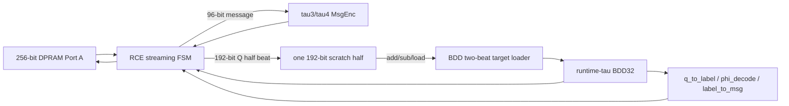

# Scloud+ RCE Streaming and Constrained-PPA Plan

Created: 2026-06-22  
Status: Draft for architecture review

## Objective

Reduce wrapper storage and unnecessary switching, then measure timing, area,
and power in the real SPUV3 RCE subsystem under a real clock constraint. Add
DSP pipeline registers only if the constrained integrated result identifies a
distance-DSP path as the remaining critical path.

The active RTL already shares one high-level 8-lane distance engine between
BDD32 and BDD16. The last measured result is 48 DSP48s; the active hierarchy is
expected to use about 40 DSP48s, pending a new Vivado run.

## Architectural Boundary

- Keep `scloud_msgfunc_rce_accel` as the only algorithm top.
- Keep payload on the 256-bit DPRAM path; do not route BW32 through the
  320-bit VPU register file or the RSA arithmetic datapath.
- Keep SFR for control/status and base addresses only.
- Preserve Verilog-2001, modulo-2^12 wrap, C-model packing, and strict `<`
  BDD tie-breaking.

## Target Architecture



## BDD Two-Beat Target Interface

Replace the BDD32 flat-load boundary with a two-beat loader. The BDD retains
one internal 384-bit `target_r`, because the recursive child calls and final
distance scan require the target throughout the operation.

| Signal | Dir | Width | Meaning |
| --- | --- | ---: | --- |
| `target_half_valid` | in | 1 | One packed Q half is valid |
| `target_half_ready` | out | 1 | BDD is idle and can accept a half |
| `target_half_sel` | in | 1 | 0=coordinates 0..15, 1=16..31 |
| `target_half_data` | in | 192 | 16 packed 12-bit coordinates |
| `start` | in | 1 | Start after both loaded bits are set |
| `start_ready` | out | 1 | Both halves loaded and child ready |

Protocol rules:

1. A transfer occurs on `target_half_valid && target_half_ready`.
2. The loader records a two-bit loaded mask and rejects overwrite while busy.
3. The wrapper sends low then high; `start` is asserted no earlier than the
   cycle after the high beat is accepted.
4. Accepting `start` clears the loaded mask for the next block while preserving
   `target_r` until the current decode finishes.
5. Reset and error recovery clear the loaded mask.

## Wrapper Streaming Schedule

### MSGDEC

```text
READ_Q0 -> CAP/LOAD_BDD_LOW -> READ_Q1 -> CAP/LOAD_BDD_HIGH
        -> START_DEC -> WAIT_DEC -> optional WRITE_Q0/Q1 -> WRITE_MSG
```

No wrapper Q cache is needed.

### SUB_MSGDEC

```text
READ_Q0 -> CAP_Q_HALF -> READ_AUX0 -> CAP/SUB/LOAD_BDD_LOW
READ_Q1 -> CAP_Q_HALF -> READ_AUX1 -> CAP/SUB/LOAD_BDD_HIGH
        -> START_DEC -> WAIT_DEC -> optional WRITE_Q0/Q1 -> WRITE_MSG
```

Only one 192-bit `q_half_r` scratch register is needed. Subtraction remains
lane-local 12-bit wrap; no saturation and no signed host arithmetic.

### MSGENC_ADD

```text
READ_MSG -> CAP_96 -> READ_Q0 -> CAP_Q_HALF -> WRITE_ADD_Q0
                    -> READ_Q1 -> CAP_Q_HALF -> WRITE_ADD_Q1
```

Use the matching 192-bit half of the combinational encoded block. Do not build
a 384-bit add result.

### MSGENC

Write the low and high halves directly from the encoded block. No Q scratch is
needed.

## Register Impact

| Storage | Current | Proposed |
| --- | ---: | ---: |
| `msg_word_r` | 256 | 96 |
| `q_in_flat_r` | 384 | 0 |
| `q_aux_flat_r` | 384 | 0 |
| streaming Q scratch | 0 | 192 |
| BDD target | 384 | 384 |

Expected wrapper reduction is about 736 state bits before synthesis cleanup.
This is an architectural estimate, not an FF report.

## Operand Isolation

Use data gating and register clock-enables; do not gate the FPGA clock in RTL.

| Cone | Enable window | Isolation action |
| --- | --- | --- |
| tau3 MsgEnc | encode op and `tau_sel=0` | Zero its 64-bit message input otherwise |
| tau4 MsgEnc | encode op and `tau_sel=1` | Zero its 96-bit message input otherwise |
| inv-phi | corresponding `ST_INV_PHI` | Zero `d_flat` outside the consume cycle |
| phi/candidate | select and distance-wait window | Hold/zero inputs outside active window |
| distance squares | `ST_RUN_A` or `ST_RUN_B` | Feed zero to lane operands while idle |
| tau-specific decode postprocess | active tau after BDD done | Isolate inactive tau network |

The distance candidates must remain stable for the complete sequential scan;
they cannot be isolated immediately after `dist_start`. Compare post-route
power with identical SAIF stimulus, because isolation muxes can cost LUT and
timing even when they reduce activity.

## Clock and Vivado Constraints

The actual RCE frequency is an integration input and must not be guessed. Let
`RCE_CLK_PERIOD_NS` denote the approved period.

Standalone/OOC smoke constraint:

```tcl
create_clock -name rce_clk -period $RCE_CLK_PERIOD_NS [get_ports clk]
set_clock_uncertainty 0.20 [get_clocks rce_clk]
```

Integrated rules:

- Constrain the real subsystem primary/generated clock, not the accelerator's
  internal clock pin if it inherits an existing clock.
- Do not apply board I/O delays to internal DPRAM buses.
- Do not declare arithmetic paths multicycle merely because the FSM is
  multi-cycle; every register-to-register combinational path remains a
  one-cycle path unless a separately proven enable relationship says otherwise.
- Report `check_timing`, clock interaction, unconstrained endpoints, WNS/TNS,
  pulse width, and high-fanout nets.
- Run implementation, not synthesis alone, before accepting Fmax.

## Integrated Subsystem Synthesis and Power

Required real-project integration points:

1. Instantiate `scloud_msgfunc_rce_accel` in `spu_subsystem`.
2. Arbitrate DPRAM Port A with explicit `RSA > Scloud > core` priority plus
   mutually exclusive owner state.
3. Block or define host Port B access while Scloud owns the relevant DPRAM.
4. Join busy/done/error/interrupt into the existing RCE status path.
5. Run post-route power with SAIF/VCD generated by representative tau3/tau4,
   two-block/four-block, fused and non-fused workloads.

The current repository does not contain `spu_subsystem` or its Vivado project,
so integrated timing/power cannot be closed here. Those sources and the real
clock definition are prerequisites.

## Conditional DSP Pipeline

Do not pipeline by default. After the shared-engine, constrained, integrated
implementation:

1. Inspect the actual worst path.
2. If it is outside the distance engine, fix that cone instead.
3. If it crosses DSP multiply/accumulate logic, add an explicit valid pipeline
   for squared differences and align chunk index, candidate A/B phase, and
   accumulator control.
4. Re-run bit-exact distance tests, BDD32 tau3/tau4 equivalence, RCE regression,
   and integrated timing.

Never use a false or multicycle constraint to hide an unpipelined DSP path.

## Implementation Phases

| Phase | Change | Primary files | Exit criteria |
| --- | --- | --- | --- |
| 0 | Constrained current baseline | real Vivado XDC/Tcl, subsystem project | No unconstrained endpoints; measured current PPA |
| 1 | Shrink message register | `scloud_msgfunc_rce_accel.v` | Existing RCE tests pass |
| 2 | Two-beat BDD load | `scloud_bdd_seq_rt.v`, BDD tests | Flat-reference equivalence passes |
| 3 | Half-stream wrapper | RCE wrapper and TB | All four ops, tau3/tau4, 2/4 blocks pass |
| 4 | Operand isolation | BDD helpers/callers and wrapper | Bit exact; SAIF toggle/power improves |
| 5 | Integrated implementation | real `spu_subsystem`, DPRAM mux, XDC/Tcl | Routed timing and power reports valid |
| 6 | Conditional DSP pipeline | distance engine only if critical | WNS closed without behavior change |

## Verification Matrix

- Two-beat low/high order, repeated half, missing half, reset between halves.
- MSGDEC and SUB_MSGDEC with `dec_write_q` both 0 and 1.
- MSGENC_ADD per-half wrap at `12'hfff + 1`.
- SUB_MSGDEC per-half wrap at `0 - 1`.
- tau3 two-block, tau4 two-block, tau3 four-block.
- 200-case sequential distance equivalence.
- Random BDD32 tau3/tau4 comparison against the parallel reference.
- DPRAM ownership collision and host-access blocking in the subsystem.
- Identical-vector pre/post-isolation toggle comparison.
- Post-route timing and power, with no unconstrained endpoints.

## Approval

- [ ] Real RCE clock frequency/period confirmed
- [ ] Real `spu_subsystem` and Vivado project available
- [ ] Two-beat interface approved
- [ ] Streaming FSM schedule approved
- [ ] Ready for implementation
